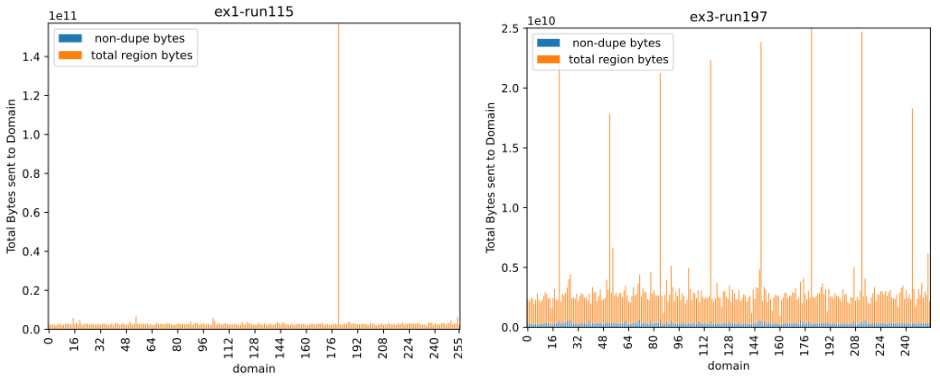

CS 5180: Reinforcement Learning and Sequential Decision Making (Fall 2021) 

Project Report 

14 December 2021 

Harry Hartenstine

	

The problem domain is a cloud file storage simulator. This was a good choice for a project because it offered a way to apply Reinforcement Learning in a real scenario, rather than the toy domains from the homeworks. As part of a [group project](https://github.com/yrrah/cs6620-fall21-intelligent-assignment-of-data-to-dedup-nodes) in CS 6620 Cloud Computing, I had written [most of](https://github.com/yrrah/cs6620-fall21-intelligent-assignment-of-data-to-dedup-nodes/graphs/contributors?from=2021-09-19&to=2021-12-26) the simulator code, so I was already familiar with it and was confident I could adapt it to use a [new algorithm](https://github.com/yrrah/cs6620-fall21-intelligent-assignment-of-data-to-dedup-nodes/blob/main/simulator/front_end/src/front_end/routing/q_learning.py) incorporating Reinforcement Learning. 

The key function of the storage simulator is de-duplication. An incoming stream of files to be backed-up is first divided into chunks, then a unique hash value is generated from each chunk. The [datasets](https://tracer.filesystems.org/) used for this project were sequences of these hash values. The underlying files used to create the dataset were snapshots of student’s home directories from the File system and Storage Lab (FSL) at Stony Brook University. 

I started with a small dataset from one user and then two more successively larger datasets. For each dataset, a metric of deduplication was calculated, given by 

( **_uncompressed size / compressed size_** )

The maximum possible deduplication would be achieved by storing everything in one place, but the purpose of this simulator was to study how to efficiently spread the work of deduplication across multiple nodes in a cluster or cloud orchestration environment. The maximum possible deduplication serves as a good metric of how repetitive the dataset was.  \

    Dataset #1:  \
	User 18 – 4.5 month period (all backups) \
	109 backups, 64 GB uncompressed size, 33x max deduplication

    Dataset #2:  \
	User 14, 18, 19 – 2 week period \
	42 backups, 258 GB uncompressed size, 27x max deduplication

    Dataset #3:  \
	User 14, 18, 19, 28 – 4.5 month period (every 20th backup) \
	23 backups, 857 GB uncompressed size, 15x max deduplication

To parallelize the work of deduplication, the stream of hashes itself can again be chunked into [“Regions”](https://www.usenix.org/legacy/events/fast11/tech/full_papers/Dong.pdf). Then a region is assigned to a worker Pod. Within each Pod, each hash is checked against a key-value store. Data is only saved if the hash is new, otherwise the existing data can just be referenced without taking up more storage space. 

The worker Pods do not share information. Two regions may contain many of the same hashes, but get sent to different pods, resulting in some duplication. For large workloads, it is not practical to maximize duplication by sending all work to a single worker. The algorithm used for assigning regions to pods can help balance the tradeoff between workload balance and deduplication. This is where Reinforcement Learning comes in. 

The raw input stream of hashes is a very large state space. The dataset uses SHA-1 hashes with 2160 possible values. Although periodic back-ups will have many repetitive sequences of hashes, learning current sequences might not generalize to future sequences. The location and number of edits made by users are unpredictable. In this problem formulation, there is no training set to tune parameters to, learning must occur as the data stream comes in. The algorithm also can’t create too much overhead such that it would significantly reduce throughput.

Dong et. al.5 offers several options for stateless routing algorithms and one stateful routing algorithm leveraging a Bloom Filter. The stateless methods convert some portion of the region hashes to an integer value, then take modulo by the number of Pods to make an assignment. Reinforcement Learning has not received significant attention as an option for stateful routing algorithms. Most of the focus is on caching, auction/voting [methods](https://dl.acm.org/doi/epdf/10.1145/3183890), or on the upstream task of creating file chunks and regions. For this project I use the stateless routing algorithms to limit the state space for input into a tabular Q-learning algorithm. 

The stateless algorithms map the SHA-1 state space of 2160 down to an arbitrarily small number of dedup “domains”. There are many more domains than actual worker Pods. Dong et. al. calls these “bins” and uses them for rebalancing the Pods periodically if a threshold of imbalance is exceeded. Instead of this, I use the domain assignment as the state value for training a **_Q(S,A)_** function. The action space is the number of worker Pods. Reward is determined by the amount of duplication that results when a region is processed by a worker Pod. **_R = _**(**_1 - _**(**_deduped size / original size _**)) 

I initialize the **_Q_** values so that domains are evenly divided among the pods. For example, with 256 domains and 8 pods, each pod has 32 domains assigned. The behavior policy for the Q learning algorithm follows an epsilon-greedy approach. Occasionally, the default domain assignment will be changed to a different pod. Most of the time, an alternate pod choice should result in less reward. Similar regions have not been sent there before, so deduplication will be poor and a small reward will be returned. However, if one domain is over-represented then the alternate pod assignments will occur multiple times. If the regions are very repetitive, then the reward from the alternate assignments will increase after repeat visits. With discounting, multiple pods eventually have very similar **_Q_** values for the over-represented domain, thus the algorithm will switch between actions, spreading the load to multiple pods. 

Experiments were run with these parameters: \
	**_Gamma = 0.9, Epsilon = 0.01, Step Size = 0.5_**

The following four plots show how one domain can get overloaded by lots of repeated content in backups. The simulator settings were identical except for the addition of Q-learning to the plots on the right. Other simulator settings were set to the best combinations for good deduplication:

**_4MB Content-Defined Regions, 256 Domains, 8 Pods, Max-fingerprint stateless algorithm_**

Standard deviation is reduced by a factor of 10 by spreading the load across other domains.

Overall deduplication reduces from 10.9X to 9.9X for Dataset 3 which had 15X as the best possible deduplication, but the workload is shared much more equally between the worker pods.  \

If we look at other simulator configurations for the same dataset, there are similar results. The blue dots show results without Q-learning. The red dots are with Q-learning added to the otherwise same configuration. There is a clear tradeoff with this algorithm. While skew of the workload is decreased, it also hurts deduplication.

This plot also shows a relationship between the number of domains and deduplication rate. When there are **_many domains_**, the over-represented domain has mostly homogenous content. When that domain is split out across the other pods, it still gets decent deduplication wherever it is sent to. With**_ few domains_**, more varied content is hashed together by the stateless algorithm. It’s less likely that matching content will be found when regions from that domain are reassigned to other pods. 

On the same plot, I also tried adding an extra factor to the reward noted as “w/Q+penalty”. I added a history buffer for each worker pod. Out of the past 1000 regions, if the majority were sent to one of the pods, I would reduce the reward there to further spread out the work. For many domains this had almost no effect, but for a small number of domains this significantly reduced deduplication. 

On Dataset 2, the base algorithm with only a deduplication reward did not do well. Deduplication was reduced without helping skew.  The “w/Q+penalty” version performed better. This showed that the performance is very sensitive to the dataset. I also added a baseline comparison to a random policy where Epsilon = 1.0. 

The results on Dataset 1 were similar, but now neither version performs very well. This was the smallest dataset so there was less overall imbalance that needed smoothing. Regardless, the Epsilon exploration of the algorithm was still a significant drag on deduplication. 

In general, a small Epsilon and a large number of domains are best for this algorithm implementation. With more time on this project I would do an experiment with more values of epsilon to see if I can get balanced performance across all the datasets. 

I also wanted to create hand-crafted datasets so I could examine specific aspects of the algorithm. The datasets were binary files created by a custom C++ program though, so they were very difficult to understand and work with directly. 

Possible future directions for this project could be to replace the stateless algorithms with alternate forms of state aggregation and to try a function approximation or neural network approach. 
